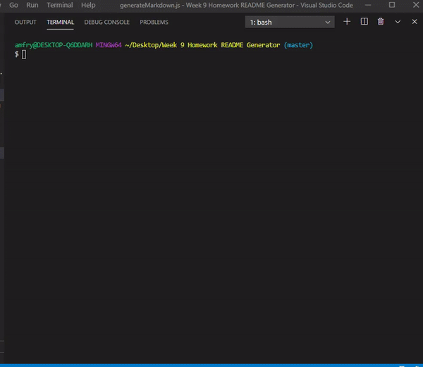

  

# CLI README Generator



## Table of Contents:
* TITLE
* VERSION
* DESCRIPTION
* INSTALLATION
* USAGE
* LICENSE
* CONTRIBUTING
* TESTS
* CONTACT


## Version:
1.0.0


## Description of CLI Generator:
Uses the CLI (command line interface) to uniquely generate a README according to user's input, including a table of contents, badge, and contact info. 


## Installation: 
### Use the following instruction to install: 

Run the command in your terminal: ```node index.js```


## Usage: 
Use the README generator according to your preference to generate a README for your projects.


## License: 


## Contributing: 
AFeese


## Tests: 
```no tests at this time```


### Questions? Contact:
AFeese, afrye13@icloud.com

